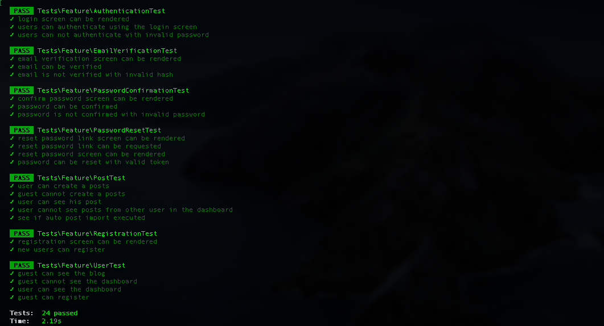

# Blog Square1 website

This project is designed to test your knowledge of web technologies and assess your ability to create robust PHP web applications with attention to software architecture and security.

## Install

This application is built in Laravel 8, the environment setup is Homestead

Add the following entry to your Homestead.yaml:

```
- map: blog-square1.test
      to: /home/vagrant/code/Blog-Square1/public
      php: "7.3" 

databases:
    - blog_square1      
```

Clone the repository using git in your homestead folder:

```
git clone git@github.com:jhonnrodr/Blog-Square1.git
cd Blog-Square1
```

The install dependencies using composer:

```
composer install
```

## Setup

Create the .env file
```
cp .env.example .env
```

Add the following params to your .env

```
DB_DATABASE=blog_square1
DB_USERNAME=homestead
DB_PASSWORD=secret

API_ENDPOINT=https://sq1-api-test.herokuapp.com/posts
```

Enter to homestead with vagrant 

```
vagrant ssh
cd /code/Blog-Square1
```

And execute migrations and dependencies:

```
php artisan key:generate
php artisan migrate --seed
```

## Configuration Auto-Post Import

```
php artisan schedule:work
```

## Testing

```
php artisan test
```



Using Admin credentials

```
email: admin@blog.com
password: admin
```
